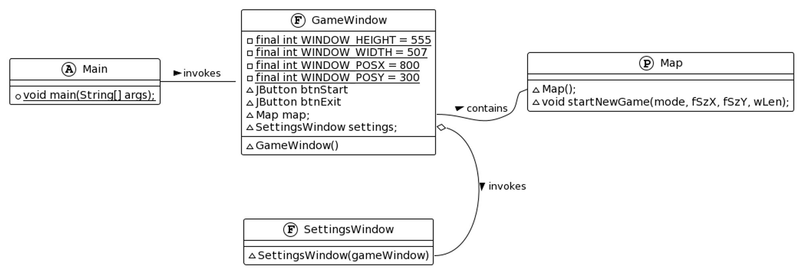
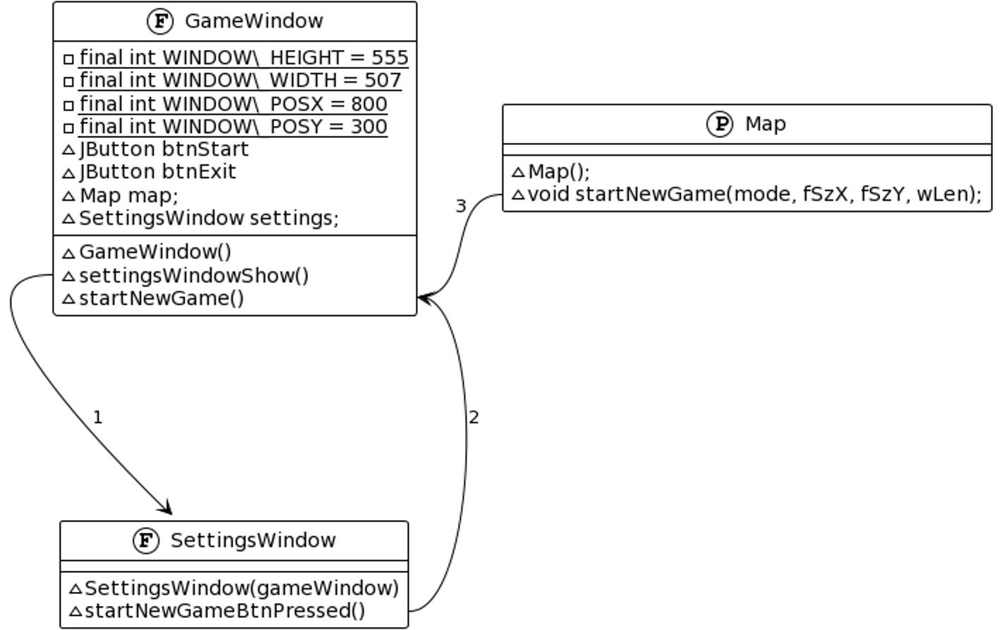
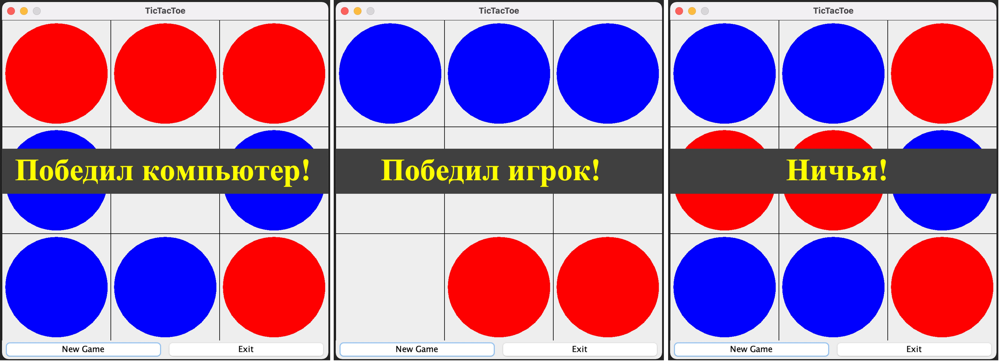

# Разработка GUI: графического интерфейса пользователя с применением Swing framework. На примере простой игры Крестики-нолики.

## Реализованы вопросы:
* создания окон,
* менеджеров размещений, 
* элементов графического интерфейса и обработчиков событий,
* окно настроек игры позволяет выбрать размер игрового поля и длину выигрышной последовательности символов,
* интерактивные компоненты меню настроек: радио-кнопки, слайдеры с ползунками, автоматическое регулирование максимального значения у слайдера выигрышной длины при изменении значения слайдера размера поля,
* логика искусственного интеллекта прописана таким образом, чтобы он пытался выиграть сам и примитивно блокировать ходы игрока,
* p.s. менюшка позволяет выбрать режим игры между двумя людьми, но его ещё не реализовал.

---
### Архитектура проекта:
Приложение работает в двух окнах:
* `первое` – стартовое, где задаются настройки поля и производиться выбор режима игры; 
* `второе` – основное, где происходит собственно игра. 

Диаграмма классов:

Буквами `F` обозначены экземпляры `JFrame`, буквой `P` `Jpanel`, а `A` это `Application`, то есть основной класс приложения. 
На диаграмме видно, что основное приложение создаёт основное окно, на которое добавлена панель `Map` и которое 
время от времени будет обращаться к `SettingsWindow` за настройками новой игры.

1. Точка входа - [Main](https://github.com/MikhailAkulov/Tic-Tac-Toe-Swing-framework-/blob/main/src/main/java/org/example/Main.java);
2. Окно графического интерфейса - класс [GameWindow](https://github.com/MikhailAkulov/Tic-Tac-Toe-Swing-framework-/blob/main/src/main/java/org/example/GameWindow.java);
3. Окно настроек новой игры [SettingsWindow](https://github.com/MikhailAkulov/Tic-Tac-Toe-Swing-framework-/blob/main/src/main/java/org/example/SettingsWindow.java);
4. Панель игрового поля - [Map](https://github.com/MikhailAkulov/Tic-Tac-Toe-Swing-framework-/blob/main/src/main/java/org/example/Map.java);

---
### Устройство программы и цепочка вызовов при старте новой игры

1. Основное окно делает окно настроек видимым; 
2. Окно настроек говорит основному, что пора начинать игру;
3. Основное окно в свою очередь знает, как именно надо игру начинать и просит панель стартовать.

---
### Возможные варианты исхода игры

---
### Небольшая презентация
